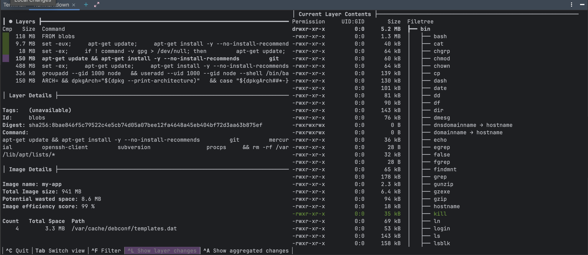
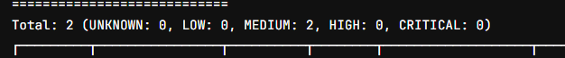

# Projet Docker test de Grype, Dive, Dockle, Trovy et Hadolint

## Objectif

Ce projet vise à construire, sécuriser, et optimiser une image Docker à l'aide des outils **Grype**, **Dive**, **Dockle**, **Trivy** et **Hadolint**. L'objectif est de créer une image Docker fiable et performante, de scanner les vulnérabilités de sécurité, et de réduire sa taille en suivant les bonnes pratiques.

## Prérequis

installr les outils suivants sur votre machine :

1. **Hadolint** : Un outil de linting pour Dockerfiles.
    - [Installation de Hadolint](https://github.com/hadolint/hadolint#installation)

2. **Grype** : Un scanner de vulnérabilités pour les images Docker.
    - [Installation de Grype](https://github.com/anchore/grype#installation)

3. **Dive** : Un outil pour réduire la taille des images Docker.
    - [Installation de Dive](https://github.com/wagoodman/dive) 

4. **Dockle** : permet de vérifier les bonnes pratiques de sécurité dans les images Docker.
    - [Installation de Dockle](https://github.com/goodwithtech/dockle?tab=readme-ov-file#installation)

5. **Trivy** : un scanner de vulnérabilités pour les images Docker.
    - [Installation de Trivy](https://trivy.dev/latest/getting-started/installation/)

## Étapes pour construire, analyser et optimiser l'image Docker

### 1. Construire l'image Docker

Commencez par construire l'image Docker à partir du `Dockerfile` contenu dans ce projet. Exécutez les commandes suivante dans votre terminal :

```bash
docker build -t my-app .
```
```bash
docker run -d -p 3000:3000  my-app
```

### 2. Vérifier les bonnes pratiques du Dockerfile avec Hadolint

Hadolint est un outil de linting pour Dockerfiles. Il permet de vérifier la qualité et la sécurité du Dockerfile en détectant les erreurs de syntaxe et en proposant des améliorations.

Exécutez la commande suivante dans le répertoire contenant votre `Dockerfile` :

```bash
hadolint Dockerfile
```


**Hadolint** analysera votre `Dockerfile` et renverra un rapport indiquant s'il y a des erreurs de syntaxe ou des améliorations possibles concernant la sécurité, les performances et les bonnes pratiques de construction d'image.

### 3. Scanner l'image pour les vulnérabilités avec Grype

Pour vérifier les vulnérabilités de sécurité dans l'image Docker, utilisez **Grype**. Exécutez la commande suivante pour analyser l'image :

```bash
grype my-app
```

Cela analysera l'image `my-app:latest` et renverra un rapport détaillant les vulnérabilités détectées dans les couches de l'image, y compris les bibliothèques et dépendances obsolètes ou vulnérables.


### 4. Optimiser l'image Docker avec Dive

Une fois l'image construite et analysée, vous pouvez la rendre plus petite et plus performante en utilisant **Dive**. Cela supprime les fichiers inutiles et optimise l'image.
x
Exécutez la commande suivante pour optimiser l'image :

```bash
dive my-app
```

Cette commande ouvrira une interface interactive où vous pourrez explorer les couches de l'image, identifier les fichiers inutiles ou volumineux, et les supprimer pour réduire la taille de l'image.

On peut parcourir les couches de l'image, afficher les fichiers, les tailles, et les statistiques, et supprimer les fichiers inutiles pour optimiser l'image.
On obtient un score sur l'efficacité de l'optimisation.



### 5. Vérifier les bonnes pratiques de sécurité avec Dockle

Dockle est un outil qui permet de vérifier les bonnes pratiques de sécurité dans les images Docker. 
Il fournit des recommandations pour améliorer la sécurité de l'image.

```bash
dockle my-app
```

 

### 6. Scanner les vulnérabilités de l'image Docker avec Trivy

Trivy est un scanner de vulnérabilités pour les images Docker. 
Il permet de détecter les vulnérabilités connues dans les dépendances et les bibliothèques des images Docker.

```bash
trivy image my-app
```



## Kubernetes
### Concepts Clés
- **Pod** : Un Pod est l'unité de base de Kubernetes. C'est l'entité qui encapsule un ou plusieurs conteneurs. Un Pod est conçu pour exécuter une tâche spécifique ou un service.

- **Deployment** : Un Deployment est un objet Kubernetes qui gère le déploiement et le cycle de vie d'un Pod. Il permet de :
  - Mettre à jour les conteneurs facilement.
  - Gérer le scaling c'est à dire ajouter ou retirer des instances.
  - Garantir que l'application fonctionne toujours avec le bon nombre de Pods.

- **Service** : Un Service est un autre objet Kubernetes qui expose les Pods à l'extérieur ou à d'autres parties du cluster. Il agit comme un point d'entrée, un reverse proxy stable pour accéder à l'application, même si les Pods changent.